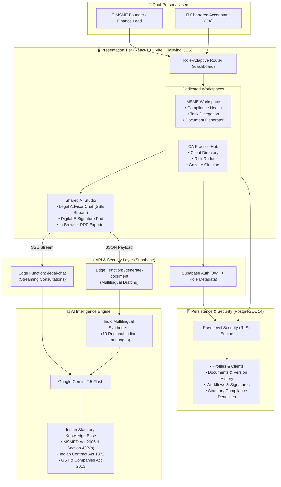
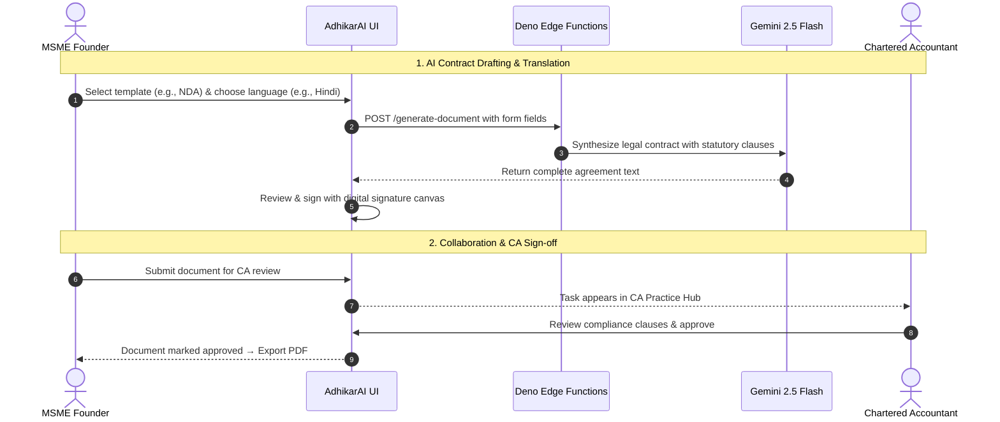

# AdhikarAI (अधिकार AI) ⚖️

<div align="center">

[](https://opensource.org/licenses/MIT)
[](https://www.typescriptlang.org/)
[](https://reactjs.org/)
[](https://vitejs.dev/)
[](https://tailwindcss.com/)
[](https://supabase.com/)
[](https://deepmind.google/technologies/gemini/)

**AI-Powered Legal & Statutory Compliance Operating System for Indian MSMEs & Chartered Accountants.**

[Architecture](#-system-architecture) •
[How It Works](#-how-adhikarai-works) •
[Key Features](#-core-features) •
[Tech Stack](#-technology-stack) •
[Quick Start](#-quick-start) •
[API Reference](#-edge-functions--api-reference)

---

</div>

## 📌 What is AdhikarAI?

Indian MSMEs handle over **1,500+ statutory filing requirements annually** across GST, Income Tax, MCA, and Labor Laws—facing severe penalties for minor oversights (such as payment disallowances under **Section 43B(h)**). Meanwhile, Chartered Accountants waste hundreds of hours manually coordinating filings and drafting standard contracts.

**AdhikarAI bridges this gap with a unified, dual-role AI platform:**

- 🏢 **For MSME Founders & Finance Teams**: Get instant legal guidance grounded in Indian statutes, draft agreements in 10 Indian languages in seconds, e-sign contracts, and track upcoming GST/IT deadlines.
- 💼 **For Chartered Accountants (CAs)**: Oversee client compliance portfolios from an executive cockpit, assign tasks, review drafts, and broadcast official gazette reforms.

---

## 🏛️ System Architecture

AdhikarAI connects a responsive React frontend to Supabase serverless services and Google's Gemini 2.5 Flash intelligence layer.

### High-Level Architecture Diagram



---

## 🔄 How AdhikarAI Works



---

## ⚡ Core Features

### 1. Dual-Persona Role Portals
- **MSME Workspace**: Clean dashboard displaying company compliance scores, upcoming tax milestones, and easy task dispatch to your CA.
- **CA Practice Hub**: Multi-client portfolio manager with client turnover brackets, PAN/GSTIN tracking, risk radars, and task Kanban boards.

### 2. AI Legal Advisor (Chatbot)
- Specialized in Indian commercial and tax statutes (MSMED Act, Section 43B(h), GST, Companies Act).
- Real-time token streaming with syntax highlighting and statutory citations.
- Persistent multi-conversation history saved in PostgreSQL.

### 3. Multilingual Legal Document Drafting
- **12+ Ready-to-Use Templates**: Non-Disclosure Agreement (NDA), Partnership Deed, Employment Contract, Service Agreement, Vendor Agreement, Commercial Lease, MOU, Loan Agreement, and more.
- **10 Indian Languages**: English, हिन्दी (Hindi), தமிழ் (Tamil), తెలుగు (Telugu), मराठी (Marathi), ગુજરાતી (Gujarati), ಕನ್ನಡ (Kannada), বাংলা (Bengali), മലയാളം (Malayalam), and ਪੰਜਾਬੀ (Punjabi).
- **Custom Template Designer**: Create bespoke company templates with dynamic fields.

### 4. Digital E-Sign & Approvals
- Draw signatures on an interactive HTML5 canvas (touch, stylus, mouse).
- Multi-step approval workflows (`pending` → `in_progress` → `approved` → `completed`).
- Version history tracking with one-click export to PDF.

### 5. Statutory Compliance Calendar
- Built-in deadlines for **GST** (GSTR-1, 3B, 9), **Income Tax** (Advance Tax, TDS), **MCA** (AOC-4, MGT-7), and **EPF/ESI**.
- Penalty clause alerts and custom reminder creation.

### 6. Government Policy Reforms Tracker
- Real-time circulars from Ministry of MSME, CBDT, CBIC, and MCA tagged with impact ratings (Critical, High, Moderate).

---

## 🧰 Technology Stack

| Layer | Technologies |
| :--- | :--- |
| **Frontend Framework** | React 18.3, TypeScript 5.8, Vite 5.4 |
| **UI Components & Styling** | Tailwind CSS 3.4, shadcn/ui, Radix UI Primitives, Lucide Icons |
| **Animations & Graphs** | Framer Motion 13, Recharts 2.15 |
| **State & Forms** | TanStack React Query v5, React Hook Form 7, Zod 3.25 |
| **Backend & Database** | Supabase (PostgreSQL 14 with Row-Level Security) |
| **Serverless Functions** | Deno Runtime (Supabase Edge Functions) |
| **AI Intelligence** | Google Gemini 2.5 Flash via Lovable AI Gateway |
| **Document Processing** | jsPDF, html2canvas |

---

## 🔒 Security & Data Isolation

AdhikarAI enforces strict **Row-Level Security (RLS)** in PostgreSQL:
- **Tenant Isolation**: Users can only read and modify records where `auth.uid() = user_id`.
- **Granular Sharing**: Documents are accessible to external collaborators only when explicitly shared via `document_shares`.
- **Tamper-Resistant Signatures**: Digital signatures record signer email, timestamp, and signature data for auditability.

---

## 🚀 Quick Start

### 1. Clone the repository
```bash
git clone https://github.com/ARJUN-PUNDIR/adhikar_ai.git
cd adhikar_ai
```

### 2. Install dependencies
```bash
npm install
```

### 3. Configure environment variables
Create a `.env` file based on `.env.example`:
```bash
cp .env.example .env
```
Fill in your Supabase credentials:
```ini
VITE_SUPABASE_PROJECT_ID="your_supabase_project_id"
VITE_SUPABASE_PUBLISHABLE_KEY="your_supabase_publishable_key"
VITE_SUPABASE_URL="https://your_project_id.supabase.co"
```

### 4. Run the development server
```bash
npm run dev
```
Open **[http://localhost:8080](http://localhost:8080)** in your browser.

> 💡 **No setup required for demo testing!** The login screen includes **One-Click Demo Logins** for both **Chartered Accountant** and **MSME Member** roles so you can explore all features immediately.

---

## 🌐 Edge Functions & API Reference

### 1. `POST /functions/v1/legal-chat`
Provides streaming legal consultations grounded in Indian business laws.

- **Request:**
  ```json
  {
    "messages": [
      {
        "role": "user",
        "content": "What is the penalty for delayed payment to MSMEs under Section 43B(h)?"
      }
    ]
  }
  ```
- **Response:** Server-Sent Events (`text/event-stream`) streaming answer tokens.

---

### 2. `POST /functions/v1/generate-document`
Drafts complete legal agreements in any of the 10 supported Indian languages.

- **Request:**
  ```json
  {
    "templateType": "nda",
    "templateName": "Non-Disclosure Agreement (NDA)",
    "language": "hindi",
    "fields": {
      "party1_name": "Bharat Robotics & Automation Pvt Ltd",
      "party2_name": "Apex Suppliers LLP",
      "effective_date": "2026-10-15",
      "purpose": "Evaluation of joint component manufacturing",
      "confidential_info": "Proprietary automation schematics and financial records"
    }
  }
  ```

- **Response:**
  ```json
  {
    "content": "Full legal text generated in Markdown format."
  }
  ```

#### 📄 Output Example (Non-Disclosure Agreement in Hindi):

```markdown
## गैर-प्रकटीकरण समझौता (Non-Disclosure Agreement)

यह गैर-प्रकटीकरण समझौता ("समझौता") 15 अक्टूबर 2026 को निम्नलिखित पक्षों के बीच निष्पादित किया गया है:

1. **प्रथम पक्ष (प्रकटीकरणकर्ता)**: Bharat Robotics & Automation Pvt Ltd
2. **द्वितीय पक्ष (प्राप्तकर्ता)**: Apex Suppliers LLP

### 1. उद्देश्य
यह समझौता दोनों पक्षों के बीच 'Evaluation of joint component manufacturing' के संबंध में गोपनीय जानकारी के आदान-प्रदान को नियंत्रित करता है।

### 2. गोपनीय जानकारी की परिभाषा
'गोपनीय जानकारी' में सभी तकनीकी डेटा, व्यापार रहस्य, स्वामित्व स्वचालन योजनाएं (Proprietary schematics) और वित्तीय रिकॉर्ड शामिल हैं...

### 3. भारतीय अनुबंध अधिनियम, 1872 के तहत दायित्व
प्राप्तकर्ता पक्ष सहमत है कि वह प्रकटीकरणकर्ता की पूर्व लिखित सहमति के बिना किसी भी तीसरे पक्ष को यह जानकारी प्रकट नहीं करेगा...

[हस्ताक्षर ब्लॉक एवं गवाह विवरण]
```

---

## 📂 Project Structure

```text
adhikar_ai/
├── src/
│   ├── components/
│   │   ├── ca/             # CA Portal: Task cards, client profile, modals
│   │   ├── documents/      # Document viewer, workflows, e-signature canvas
│   │   ├── layouts/        # Adaptive sidebar and dashboard layouts
│   │   └── ui/             # Radix & shadcn/ui components
│   ├── contexts/
│   │   └── AuthContext.tsx # Role management (CA vs MSME Member) & demo logins
│   ├── data/
│   │   └── mockCAData.ts   # Sample clients, statutory tasks, and policy reforms
│   ├── pages/
│   │   ├── ca/             # CA pages: Clients, Tasks, Policy Reforms, Calendar
│   │   ├── Auth.tsx        # Role-based onboarding & login
│   │   ├── Chatbot.tsx     # Gemini-powered legal assistant
│   │   ├── Compliance.tsx  # Statutory compliance calendar
│   │   ├── Dashboard.tsx   # MSME company dashboard
│   │   └── Documents.tsx   # Document generator & repository
│   └── types/              # TypeScript domain interfaces
├── supabase/
│   ├── functions/          # Deno Edge Functions (legal-chat, generate-document)
│   └── migrations/         # PostgreSQL database schema & RLS policies
└── package.json
```

---

## 📄 License

This project is licensed under the **MIT License**.

---

<div align="center">

Built with ❤️ for Indian MSMEs & Chartered Accountants by **[Arjun Singh Pundir](https://github.com/ARJUN-PUNDIR)**

</div>
