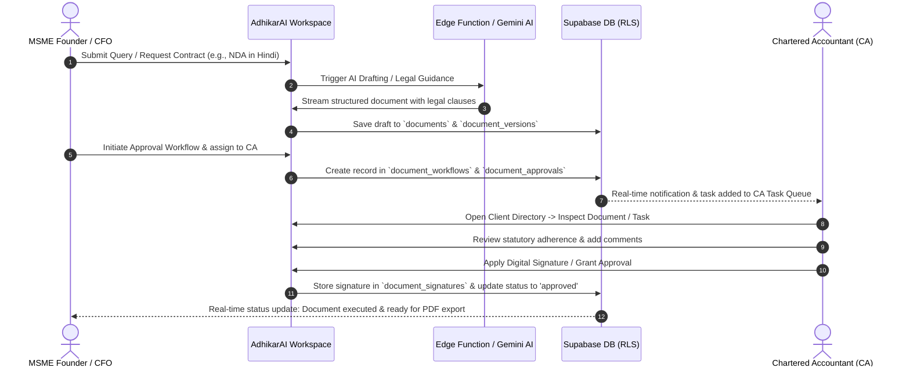
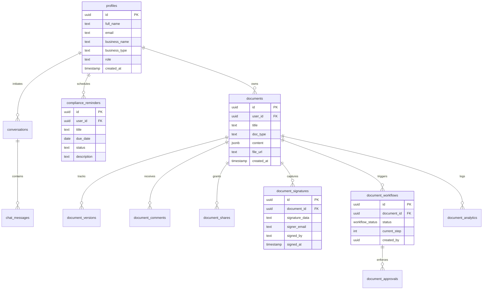

# AdhikarAI (अधिकार AI) ⚖️

<div align="center">

[](https://opensource.org/licenses/MIT)
[](https://www.typescriptlang.org/)
[](https://reactjs.org/)
[](https://vitejs.dev/)
[](https://tailwindcss.com/)
[](https://supabase.com/)
[](https://deepmind.google/technologies/gemini/)
[](https://github.com/ARJUN-PUNDIR/adhikar_ai/pulls)

**Next-Generation AI Legal & Statutory Compliance Operating System for Indian MSMEs & Chartered Accountants.**

[Explore Architecture](#-system-architecture) •
[Key Features](#-core-features--capabilities) •
[Tech Stack](#-technology-stack) •
[Database Design](#-database--security-architecture) •
[Getting Started](#-getting-started--local-development) •
[API Reference](#-edge-functions--api-reference)

---

</div>

## 📌 Executive Overview

**AdhikarAI** (अधिकार AI) is an intelligent, dual-persona compliance platform engineered specifically to demystify complex Indian regulatory frameworks for Micro, Small, and Medium Enterprises (MSMEs) while equipping Chartered Accountants (CAs) with an enterprise-grade client management hub.

### The Problem It Solves
Indian small businesses confront over **1,500+ statutory filings and compliance clauses annually** spanning:
- **Direct & Indirect Taxes**: GST (GSTR-1, 3B, 9), Income Tax, TDS, and Advance Tax.
- **Micro Enterprise Protection**: Strict 45-day payment timelines and disallowances under **Section 43B(h)** of the Income Tax Act.
- **Corporate Law & Labor**: MCA filings (AOC-4, MGT-7), EPF/ESI statutory challans, Factory Acts, and commercial agreements.

Small business owners frequently operate under severe risk of hefty penalties due to ambiguous legalese and missed deadlines, while Chartered Accountants waste hundreds of billable hours per month manually tracking client deliverables through fragmented spreadsheets, email threads, and manual drafting.

### The Solution: AdhikarAI
AdhikarAI unifies:
1. **Domain-Tuned Legal Intelligence**: Instant advice backed by Indian statutes via Google Gemini 2.5 Flash.
2. **Multilingual Drafting Engine**: Automated contract generation across **10 Indian languages** with in-browser digital e-signatures and approval workflows.
3. **Dual-Persona Collaboration**: Shared workspaces connecting MSME leadership directly to their empanelled Chartered Accountants.
4. **Statutory Intelligence Radar**: Real-time government circular parsing (MCA, CBIC, CBDT, MSME Ministry) and dynamic compliance calendars.

---

## 🏛️ System Architecture

AdhikarAI is built on an asynchronous, event-driven, multi-tier cloud architecture ensuring rapid client rendering, strict multi-tenant isolation via Row-Level Security (RLS), and resilient AI streaming pipelines.

### High-Level Architecture Diagram

```mermaid
graph TB
    subgraph ClientTier["Client Tier (SPA & Responsive UI)"]
        A1["MSME Workspace\n(Founders / Finance Leads)"]
        A2["CA Practice Hub\n(Chartered Accountants / Auditors)"]
        UI["shadcn/ui + Radix UI + Tailwind CSS"]
        State["TanStack React Query + React Hook Form + Zod"]
    end

    subgraph GatewayTier["API, Security & Edge Tier"]
        AuthModule["Supabase Auth\n(JWT / OAuth / RBAC)"]
        Router["React Router v6\n(Role-Adaptive Routing)"]
        EdgeLegal["Edge Function: legal-chat\n(Deno / SSE Streaming)"]
        EdgeDoc["Edge Function: generate-document\n(Deno / Multilingual Engine)"]
    end

    subgraph AIEngine["AI Intelligence Layer"]
        GeminiFlash["Google Gemini 2.5 Flash\n(Lovable AI Gateway)"]
        SystemPrompts["Indian MSME Legal Knowledge Base\n(MSMED Act, Contract Act 1872, GST, IT Act)"]
        LangProcessor["Indic Multilingual Synthesizer\n(10 Regional Languages)"]
    end

    subgraph DataStorageTier["Persistence & Security Tier (Supabase PostgreSQL 14)"]
        RLS["Row Level Security (RLS) Engine"]
        ProfilesTab["profiles (RBAC & Business Metas)"]
        DocsTab["documents & document_versions"]
        WorkflowsTab["document_workflows & approvals"]
        SignaturesTab["document_signatures (E-Sign Hash)"]
        ComplianceTab["compliance_reminders (Statutory Calendars)"]
        ChatTab["conversations & chat_messages"]
    end

    A1 --> Router
    A2 --> Router
    Router --> AuthModule
    AuthModule --> UI
    UI --> State

    State -->|HTTP/REST| RLS
    State -->|POST /chat (SSE)| EdgeLegal
    State -->|POST /generate| EdgeDoc

    EdgeLegal --> SystemPrompts
    EdgeLegal --> GeminiFlash
    EdgeDoc --> LangProcessor
    EdgeDoc --> GeminiFlash

    RLS --> ProfilesTab
    RLS --> DocsTab
    RLS --> WorkflowsTab
    RLS --> SignaturesTab
    RLS --> ComplianceTab
    RLS --> ChatTab
```

---

### Dual-Persona Collaborative Workflow



---

## ⚡ Core Features & Capabilities

### 1. Dual-Persona Role-Adaptive Interface
AdhikarAI intelligently adapts its navigation hierarchy, dashboards, and operational toolsets based on whether the logged-in user is a Chartered Accountant or a Corporate MSME stakeholder:

| Capability | MSME Member Workspace | CA Practice Hub |
| :--- | :--- | :--- |
| **Primary Dashboard** | Internal compliance health, pending work orders, quick actions | Multi-client portfolio radar, aggregate risk metrics, urgent alerts |
| **Client Management** | View designated CA firm & assigned audit partners | Filter clients by sector, turnover bracket, PAN/GSTIN, risk grade |
| **Statutory Calendar** | Company-specific filing timeline with countdown badges | Cross-client statutory deadline heatmaps with penalty advisories |
| **Task Delegation** | Dispatch work orders & upload invoices/agreements to CA | Kanban board for client tasks, checklists, and time estimation |
| **Policy Circulars** | Simplified executive summaries of legal reforms | Comprehensive regulatory circulars from CBDT, CBIC, MCA, MSME |

---

### 2. Specialized AI Legal Assistant
- **Statute-Grounded Advice**: Tailored specifically for Indian business legislation including the **Micro, Small and Medium Enterprises Development (MSMED) Act, 2006**, **Companies Act, 2013**, **Goods and Services Tax (GST) Act**, and **Indian Contract Act, 1872**.
- **Section 43B(h) Guidance**: Step-by-step assistance in managing supplier payment cycles, invoice verification, and tax disallowance avoidance.
- **Server-Sent Events (SSE) Streaming**: Token-by-token instant responses rendered using `react-markdown` with syntax-highlighted legal breakdowns.
- **Persistent Conversation Threads**: Auto-saving chat sessions with contextual search and thread history stored in PostgreSQL.

---

### 3. Automated Legal Document Drafting Engine
Generate ironclad, court-tested legal contracts in minutes with custom dynamic variables:

- **12+ Production Templates Built-in**:
  - `Partnership Deed` (Capital sharing, dispute settlement, liability)
  - `Non-Disclosure Agreement (NDA)` (Bilateral & unilateral IP protection)
  - `Employment Contract` (Probation, IP rights, non-compete clauses)
  - `Service Level Agreement (SLA)` & `Vendor Agreement`
  - `Commercial Lease Agreement` (Premises usage, deposit, maintenance)
  - `Memorandum of Understanding (MOU)`
  - `Sale of Goods Agreement` & `Business Loan Agreement`
  - `Consultancy Agreement`, `Franchise Agreement`, and `IP Assignment`
- **10 Indian Languages Supported**:
  - English, हिन्दी (Hindi), தமிழ் (Tamil), తెలుగు (Telugu), मराठी (Marathi), ગુજરાતી (Gujarati), ಕನ್ನಡ (Kannada), বাংলা (Bengali), മലയാളം (Malayalam), ਪੰਜਾਬੀ (Punjabi).
- **Custom Template Designer**: Define proprietary legal forms with arbitrary dynamic JSON fields.
- **In-Browser Export**: High-fidelity PDF rendering via `jspdf` and `html2canvas`.

---

### 4. Collaborative Document Workflow & E-Sign
- **Multi-Step Approval Workflows**: Configure linear approval chains (`pending` → `in_progress` → `approved` → `completed`).
- **Audit-Logged Commentary**: Threaded comments tied directly to document IDs for seamless legal back-and-forth.
- **Canvas Digital Signature Pad**: Sign directly via touch screen, stylus, or trackpad with base64 signature recording, signer identity stamp, and tamper-resistant storage.
- **Version Control**: Complete version trees captured in `document_versions` allowing instant revision comparison and rollback.

---

### 5. Statutory Compliance & Tax Calendar
- **Automated Deadline Radar**: Preloaded with statutory cut-offs:
  - **GST**: GSTR-1, GSTR-3B monthly/quarterly filings, GSTR-9 annual returns.
  - **Direct Tax**: Advance tax installments, TDS return filings, corporate ITR-6.
  - **MCA / ROC**: AOC-4 (Financial Statements), MGT-7 (Annual Returns), DIR-3 KYC.
  - **Labor Compliances**: EPF & ESI monthly contributions.
- **Penalty & Interest Warners**: Clear indicators on statutory consequences (e.g., Section 234A/B/C interest, Section 47 late fees).
- **Custom Corporate Reminders**: Add bespoke enterprise compliance milestones with alert notifications.

---

### 6. Document & Compliance Analytics
- **Visual Analytics Suite**: Built with `recharts` to monitor:
  - Total documents generated vs. completed/executed.
  - E-Signature completion rate percentages.
  - Usage distribution across contract templates.
  - 7-day activity velocity and compliance audit trail.

---

## 🧰 Technology Stack

```
Frontend:
├── Framework: React 18.3 (TypeScript 5.8)
├── Bundler & Dev: Vite 5.4 + SWC Plugin
├── UI Primitives: Radix UI (20+ headless components)
├── Design System: Tailwind CSS 3.4 + shadcn/ui
├── Animations: Framer Motion 13 + Lucide React Icons
├── Forms & Validation: React Hook Form 7 + Zod 3.25
└── Visualizations: Recharts 2.15

Backend & Cloud Infrastructure:
├── Database: Supabase PostgreSQL 14
├── Serverless Runtime: Supabase Edge Functions (Deno 1.x)
├── Security: Row-Level Security (RLS) + Cryptographic JWT
├── Storage: Supabase Storage Buckets
└── AI Orchestration: Google Gemini 2.5 Flash via Lovable AI Gateway
```

---

## 🗄️ Database & Security Architecture

AdhikarAI enforces **strict tenant isolation** through PostgreSQL Row-Level Security (RLS). Every table is locked down so that users can only inspect, mutate, or share data corresponding to their authorized security tokens.

### Entity Relationship Diagram (ERD)



### Row Level Security (RLS) Policy Matrix

| Table | SELECT Policy | INSERT / UPDATE Policy | DELETE Policy |
| :--- | :--- | :--- | :--- |
| `profiles` | `auth.uid() = id` | `auth.uid() = id` | Cascade on user deletion |
| `documents` | `auth.uid() = user_id` OR Shared email in `document_shares` | `auth.uid() = user_id` | `auth.uid() = user_id` |
| `document_workflows` | Owner of document or assigned approver | Document owner only | Document owner only |
| `document_comments` | Document owner or shared collaborator | Document owner or shared collaborator | Author only |
| `document_signatures`| Document owner or signer | Signer matches authorized workflow step | Restricted |
| `compliance_reminders` | `auth.uid() = user_id` | `auth.uid() = user_id` | `auth.uid() = user_id` |
| `conversations` | `auth.uid() = user_id` | `auth.uid() = user_id` | `auth.uid() = user_id` |
| `chat_messages` | `auth.uid() = user_id` | `auth.uid() = user_id` | `auth.uid() = user_id` |

---

## 📂 Directory Structure

```text
adhikar_ai/
├── public/                     # Static assets (favicons, robots.txt)
├── supabase/                   # Supabase configuration & migrations
│   ├── config.toml             # Supabase project settings
│   ├── functions/              # Deno Serverless Edge Functions
│   │   ├── generate-document/  # AI Multilingual Document Generator
│   │   │   └── index.ts
│   │   └── legal-chat/         # AI Legal Advisor Streaming SSE
│   │       └── index.ts
│   └── migrations/             # Idempotent PostgreSQL schema & RLS scripts
├── src/
│   ├── components/
│   │   ├── ca/                 # CA Portal components (TaskCard, ClientProfile, Modals)
│   │   ├── common/             # Global components (NotificationCenter, Badges)
│   │   ├── documents/          # Document editor, workflow, e-sign pad, PDF generator
│   │   ├── layouts/            # Role-adaptive DashboardLayout & dynamic sidebars
│   │   └── ui/                 # 40+ shadcn/ui components (Radix primitives)
│   ├── contexts/
│   │   └── AuthContext.tsx     # Dual-role Auth state & demo account switchers
│   ├── data/
│   │   ├── mockCAData.ts       # Comprehensive MSME client, task & reform seed data
│   │   └── registeredCompanies.ts # Corporate directory verification registry
│   ├── hooks/                  # Custom React hooks (toast, mobile detection)
│   ├── integrations/
│   │   └── supabase/           # Strongly-typed Supabase client and Database definitions
│   │       ├── client.ts
│   │       └── types.ts
│   ├── pages/                  # Main routed application views
│   │   ├── ca/                 # CA-dedicated routes (Dashboard, Clients, Reforms, etc.)
│   │   ├── Account.tsx         # Practice / Corporate profile settings
│   │   ├── Analytics.tsx       # Document & compliance usage telemetry
│   │   ├── Auth.tsx            # Multi-persona onboarding & authentication
│   │   ├── Chatbot.tsx         # AI Legal Advisor interface
│   │   ├── Compliance.tsx      # Statutory calendar & reminder manager
│   │   ├── Dashboard.tsx       # MSME Company Dashboard
│   │   ├── Documents.tsx       # Document Generator & Library
│   │   └── Index.tsx           # Public landing page
│   ├── types/
│   │   └── ca.ts               # Domain interfaces (Clients, Tasks, Reforms, Deadlines)
│   ├── App.tsx                 # Route declarations & QueryClient provider
│   ├── index.css               # Design tokens, CSS variables & HSL themes
│   └── main.tsx                # React root entry point
├── package.json
├── tailwind.config.ts
├── tsconfig.json
└── vite.config.ts
```

---

## 🚀 Getting Started & Local Development

### Prerequisites
- **Node.js**: v18.0.0 or higher ([Download Node.js](https://nodejs.org/))
- **Package Manager**: `npm` (v9+) or `bun`
- **Supabase Account / CLI**: Optional for full backend deployment ([supabase.com](https://supabase.com))

---

### Step 1: Clone the Repository
```bash
git clone https://github.com/ARJUN-PUNDIR/adhikar_ai.git
cd adhikar_ai
```

---

### Step 2: Install Dependencies
```bash
npm install
# or if using bun:
bun install
```

---

### Step 3: Configure Environment Variables
Create a local `.env` file in the root directory:

```bash
cp .env.example .env
```

Populate the following variables:

```ini
# Supabase Project Configuration
VITE_SUPABASE_PROJECT_ID="your-project-id"
VITE_SUPABASE_URL="https://your-project-id.supabase.co"
VITE_SUPABASE_PUBLISHABLE_KEY="your-anon-key"

# AI Gateway Key (Configured in Supabase Secrets for Edge Functions)
# LOVABLE_API_KEY="your-gemini-or-lovable-api-key"
```

> **Note**: For local UI testing without Supabase credentials, AdhikarAI features **One-Click Demo Personas** built directly into the login screen allowing instant testing as **Chartered Accountant** or **MSME Enterprise Member**.

---

### Step 4: Start the Local Development Server
```bash
npm run dev
```

Visit `http://localhost:8080` (or the port specified in terminal) to view the application.

---

### Step 5: (Optional) Local Supabase Database & Edge Functions
If you want to run the Supabase infrastructure locally:

```bash
# 1. Initialize Supabase
npx supabase init

# 2. Start local Supabase containers (Docker required)
npx supabase start

# 3. Apply schema migrations
npx supabase db reset

# 4. Serve Edge Functions locally
npx supabase functions serve --env-file .env
```

---

## 🌐 Edge Functions & API Reference

AdhikarAI leverages serverless Deno Edge Functions for AI processing to safeguard API keys and stream responses efficiently.

### 1. `POST /functions/v1/legal-chat`
Streams interactive legal consultations grounded in Indian statutory compliance.

**Request Body:**
```json
{
  "messages": [
    {
      "role": "user",
      "content": "What are the compliance mandates under Section 43B(h) for MSME payments?"
    }
  ]
}
```

**Response:**
Server-Sent Events (`text/event-stream`) streaming token deltas in real-time.

---

### 2. `POST /functions/v1/generate-document`
Drafts a legally binding agreement based on structured inputs and desired regional language.

**Request Body:**
```json
{
  "templateType": "nda",
  "templateName": "Non-Disclosure Agreement (NDA)",
  "language": "hindi",
  "fields": {
    "party1_name": "Sharma Technologies Pvt Ltd",
    "party2_name": "Verma Enterprises",
    "effective_date": "2026-10-15",
    "purpose": "Evaluation of joint manufacturing partnership",
    "confidential_info": "Proprietary robotic designs and financial records"
  }
}
```

**Response:**
```json
{
  "content": "## गैर-प्रकटीकरण समझौता (Non-Disclosure Agreement)\n\nयह समझौता..."
}
```

---

## 🧪 Testing & Code Quality

```bash
# Run ESLint to verify codebase standards
npm run lint

# Build production bundle with TypeScript type-checking
npm run build

# Preview production build locally
npm run preview
```

---

## 🗺️ Product Roadmap

- [x] Dual Persona Portals (Chartered Accountant & MSME Member)
- [x] Gemini 2.5 Flash Legal Chatbot with SSE streaming
- [x] 12+ MSME Document Templates in 10 Indian Regional Languages
- [x] In-browser HTML5 Canvas E-Signature & Multi-Step Approvals
- [x] Statutory Compliance & Tax Calendar (GST, IT, ROC, MCA)
- [x] Document Analytics & Telemetry Dashboard
- [ ] **WhatsApp Business API Integration**: Push compliance reminders & deadline warnings directly to founder WhatsApp.
- [ ] **DigiLocker & MCA V3 API Connectors**: Automatic CIN, GSTIN, and DIN document verification.
- [ ] **Automated GSTR-2B vs Books Reconciliation**: AI-assisted ITC mismatch detector.
- [ ] **Bilingual Audio Consultation**: Voice-driven legal query interface in Hindi and regional dialects.

---

## 🤝 Contributing

Contributions, issues, and feature requests are welcome!

1. Fork the repository (`https://github.com/ARJUN-PUNDIR/adhikar_ai/fork`)
2. Create your feature branch (`git checkout -b feature/AmazingFeature`)
3. Commit your changes (`git commit -m 'feat: Add AmazingFeature'`)
4. Push to the branch (`git push origin feature/AmazingFeature`)
5. Open a Pull Request

---

## 📄 License

Distributed under the **MIT License**. See [`LICENSE`](LICENSE) for more information.

---

<div align="center">

Made with ❤️ for Indian MSMEs & Chartered Accountants by **[Arjun Singh Pundir](https://github.com/ARJUN-PUNDIR)**

</div>
